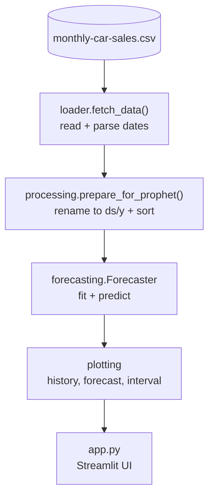

# Dashboard-Forecasting

Interactive time-series dashboard: loads monthly sales history, fits a Prophet
model and reports the forecast with its uncertainty interval.


**Live Demo:** [Streamlit App](https://jorgeasmz-dashboard-forecasting.streamlit.app/)

## Architecture



Each stage is a module with a single responsibility, so the forecasting core can
be exercised without a Streamlit runtime.

## Results

Backtest over the [Monthly Car Sales](https://github.com/jbrownlee/Datasets/blob/master/monthly-car-sales.csv)
dataset: 108 observations, last 12 months (1968-01 to 1968-12) held out.

| Model | MAPE % | MAE | RMSE |
|---|---:|---:|---:|
| **Prophet** | **7.19** | **1336.8** | **1749.2** |
| Seasonal naive (t-12) | 10.83 | 1959.5 | 2290.8 |
| Naive (last value) | 22.27 | 4599.0 | 5865.4 |

Prophet halves the error of the seasonal baseline, which is the bar a forecast
has to clear to be worth deploying. Reproduce with:

```bash
python evaluate.py
```

## Quickstart

```bash
python -m venv venv && source venv/bin/activate
pip install -r requirements.txt
streamlit run app.py
```

The dataset is fetched from a public URL on first run and cached by Streamlit.

## Development

```bash
pip install -r requirements-dev.txt

pytest                  # 13 tests, 100% coverage of src/
pytest -m "not slow"    # skips the three that fit a real Prophet model
ruff check .
```

## Technical decisions

**Data access split from the Streamlit wrapper.** `fetch_data()` is pure and
raises on failure; `load_data()` adds `@st.cache_data`, catches, and degrades to
an empty DataFrame so the UI shows a warning instead of a traceback. Previously
both concerns lived in one function, which made the loader untestable without a
Streamlit runtime and made "no data" indistinguishable from "download failed".

**`plot_forecast` does not use `prophet.plot.plot_plotly`.** That helper runs
`assert m.history` on a DataFrame, and pandas raises `ValueError: The truth
value of a DataFrame is ambiguous` rather than evaluating truthiness, so it
fails on any fitted model. The figure is built with `graph_objects` instead,
which also keeps it consistent with the components plot.

**Contract tests, not accuracy tests.** The suite asserts shapes, schemas and
error behaviour; it never asserts on predicted values, which would make it
brittle. Forecast quality is measured separately by `evaluate.py`.

**Pinned versions and an explicit lint contract.** `requirements.txt` pins exact
versions and `ruff.toml` declares the rule selection. Without both, `ruff check`
means whatever the installed version happens to default to, and CI turns red on
unrelated toolchain releases.

## Project structure

```text
Dashboard-Forecasting/
├── app.py                 # Streamlit entry point
├── evaluate.py            # Backtest against naive baselines
├── src/
│   ├── config.py          # Dataset URL and column names
│   ├── loader.py          # Data access (pure) + cached wrapper
│   ├── processing.py      # Reshape to Prophet's ds/y schema
│   ├── forecasting.py     # Forecaster: fit and predict
│   └── plotting.py        # Plotly figures
├── tests/                 # pytest suite
├── ruff.toml              # Lint rule selection
└── .github/workflows/     # CI: lint + tests
```
