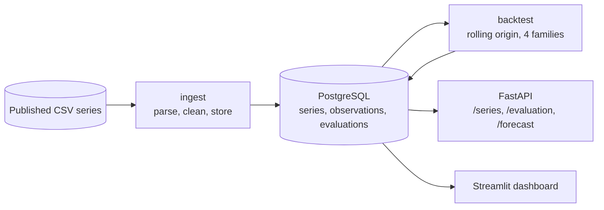

# Dashboard-Forecasting

Backtests four forecasting model families against five time series with
rolling-origin cross-validation, selects a model per series and serves its
forecast through a REST API and a Streamlit dashboard.


**Live Demo:** [Streamlit App](https://jorgeasmz-dashboard-forecasting.streamlit.app/)

## Series

| Series | Observations | Frequency | Cycle | Horizon |
|---|---:|---|---:|---:|
| Airline passengers | 144 | monthly | 12 | 12 |
| Monthly car sales | 108 | monthly | 12 | 12 |
| Monthly sunspots | 600 | monthly | 1 | 12 |
| Daily minimum temperatures | 1,460 | daily | 365 | 28 |
| Daily female births | 365 | daily | 7 | 14 |

The sunspot series is treated as non-seasonal because its cycle runs about 132
months, which no seasonal term in this project can represent. It is truncated to
the most recent 600 observations, and the temperature series to 1,460, to keep
SARIMA fitting time bounded.

## Evaluation method

A single train/test split measures one window of one series. Each fold here
advances the training cutoff by one horizon and refits every model, producing
four measurements per model and series, or 80 fits in total.

The three metrics reported are MAE, RMSE and MASE, together with interval
coverage.

MAPE is not used. The series span four orders of magnitude, from single-digit
temperatures to car sales in the tens of thousands, and two of them contain
values below 1.0: sunspots reach 0.20 and temperatures 0.50. A five-unit error
against an observation of 0.20 registers as 2,500%, which would dominate any
average that included it. MASE divides the mean absolute error by the in-sample
mean absolute error of the seasonal naive, so a value of 1.0 means the model
matched that baseline and values above 1.0 mean it did not.

Coverage is the share of held-out observations that fall inside the 80%
prediction interval. Every model family emits `yhat_lower` and `yhat_upper`, so
the figure is comparable across them.

## Results

Lowest mean MASE per series, over four folds:

| Series | Selected model | MASE | Coverage |
|---|---|---:|---:|
| Daily minimum temperatures | prophet | 0.688 | 75% |
| Daily female births | prophet | 0.779 | 80% |
| Airline passengers | sarima | 0.794 | 67% |
| Monthly car sales | seasonal_naive | 0.999 | 100% |
| Monthly sunspots | lightgbm | 2.041 | 35% |

Three different families win across five series, and on one of them no family
beats the baseline.

### Car sales

This series is the one the project previously used on its own, evaluated on a
single split of the final twelve months. Under that split Prophet reduced the
error of the seasonal naive by roughly a third. Across four folds the ordering
reverses:

| Model | MASE | MAE | Coverage |
|---|---:|---:|---:|
| **seasonal_naive** | **0.999** | **1,584.98** | 100% |
| prophet | 1.114 | 1,778.63 | 44% |
| lightgbm | 1.130 | 1,801.69 | 46% |
| sarima | 1.306 | 2,086.20 | 67% |

The earlier result held for one window and did not generalise to the others.

### Interval calibration

Nominal interval width is 80%. Observed coverage ranges from 35% to 100%
depending on the model and series:

| Model | Coverage range across series |
|---|---|
| sarima | 56% to 80% |
| seasonal_naive | 71% to 100% |
| prophet | 40% to 80% |
| lightgbm | 35% to 55% |

LightGBM under-covers on every series. Its intervals come from quantile
regression at 0.1 and 0.9, evaluated at each recursive step, and that procedure
does not accumulate the uncertainty introduced by feeding predicted values back
into the lag features. SARIMA, whose intervals derive from the state-space
model's own variance, tracks the nominal level most closely.

## Architecture



Every model family implements the same two methods and returns the same four
columns, which is what lets the backtest score point accuracy and interval
calibration identically across them.

## Quickstart

```bash
python -m venv venv && source venv/bin/activate
pip install -r requirements.txt

alembic upgrade head        # creates the schema, SQLite by default
python -m src.pipeline      # downloads, stores and backtests every series

streamlit run app.py        # dashboard on :8501
python -m api.main          # API on :8000
```

With no `DATABASE_URL` the project falls back to a local SQLite file and runs
with no infrastructure. Setting the variable to a PostgreSQL connection string
is the only change required for a deployment; connection strings in the
`postgres://` and `postgresql://` forms are rewritten to use psycopg 3.

## API

| Method | Path | Purpose |
|---|---|---|
| GET | `/` | Health check and ingested series count |
| GET | `/series` | Every series with its selected model |
| GET | `/series/{slug}/observations` | Stored history |
| GET | `/series/{slug}/evaluation` | Mean backtest metrics per model |
| GET | `/series/{slug}/forecast` | Forecast from the selected model |
| GET | `/docs` | Swagger UI |

## Development

```bash
pip install -r requirements-dev.txt

pytest              # 60 tests, 95% coverage of src/ and api/
ruff check .
```

The suite is offline. Series are read from fixtures rather than downloaded,
models are fitted on a 60-point synthetic series, and the database is a
temporary SQLite file. CI additionally applies the migrations against a
PostgreSQL service container.

## Technical decisions

**Rolling origin rather than a single split.** Four folds per series and model
report the mean of four measurements. The car sales result shows what a single
split can conclude.

**MASE as the selection metric.** It is scale-free, which the mixture of series
requires, and it does not degrade near zero, which MAPE does on two of them.

**Interval coverage reported alongside point accuracy.** A point forecast
without a calibrated interval states more confidence than the model holds.

**Series metadata stored in the database, not read from the registry at serving
time.** The registry defines what to ingest. Once ingested, frequency, seasonal
period and horizon travel with the series, so the API and the dashboard depend
on the database alone.

**SARIMA falls back to a non-seasonal specification above a 24-period cycle.**
Fitting cost grows with the seasonal period, and a 365-day cycle is not
tractable in this configuration.

**Migrations own the schema.** Alembic runs before the service starts. The
project previously had no persistence at all, so the schema is versioned from
its first revision.

## Project structure

```text
Dashboard-Forecasting/
├── src/
│   ├── config.py         # Series registry and settings
│   ├── database.py       # Engine, session, declarative base
│   ├── schema.py         # Series, Observation, Evaluation
│   ├── ingest.py         # Download, clean and store
│   ├── forecasters.py    # Four families behind one interface
│   ├── backtest.py       # Rolling origin, MASE, coverage
│   ├── selection.py      # Aggregation and model choice
│   ├── serving.py        # Forecast with the selected model
│   ├── plotting.py       # Plotly figures
│   └── pipeline.py       # Batch entry point
├── api/                  # FastAPI service
├── alembic/              # Schema migrations
├── app.py                # Streamlit dashboard
├── tests/                # pytest suite
└── ruff.toml             # Lint rule selection
```
