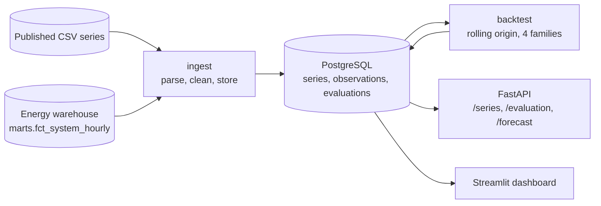

# Dashboard-Forecasting

Backtests four forecasting model families against seven time series with
rolling-origin cross-validation, selects a model per series and serves its
forecast through a REST API and a Streamlit dashboard. Two of the series are the
Colombian spot electricity price, read from the warehouse of a separate project
at two grains that differ by a factor of twenty-four.


**Live Demo:** [Streamlit App](https://jorgeasmz-dashboard-forecasting.streamlit.app/)

## Series

| Series | Observations | Frequency | Cycle | Horizon |
|---|---:|---|---:|---:|
| Airline passengers | 144 | monthly | 12 | 12 |
| Monthly car sales | 108 | monthly | 12 | 12 |
| Monthly sunspots | 600 | monthly | 1 | 12 |
| Daily minimum temperatures | 1,460 | daily | 365 | 28 |
| Daily female births | 365 | daily | 7 | 14 |
| Colombian spot price, daily | 3,896 | daily | 7 | 14 |
| Colombian spot price, hourly | 93,504 | hourly | 24 | 24 |

The sunspot series is treated as non-seasonal because its cycle runs about 132
months, which no seasonal term in this project can represent. It is truncated to
the most recent 600 observations, and the temperature series to 1,460, to keep
SARIMA fitting time bounded.

The two price series are the same measurement at two grains. The hourly one is
what the market settles, and its horizon is the day ahead. The daily one is the
mean of each complete day, which is what makes the annual cycle visible in a
history a seasonal term can reach.

## The warehouse as a source

The price series are not files. They are read from `marts.fct_system_hourly` in
the [Energy Data Platform](https://github.com/jorgeasmz/Energy-Data-Platform)
warehouse, a table whose columns and types are under an enforced contract there,
so a column that changes type fails that project's build rather than this
project's ingestion.

The read happens once, when a series is ingested, and the observations are stored
here like any other. Nothing the API or the dashboard serves reaches the
warehouse, so this demo stays up while that database is asleep, and a backtest
refits without a network round trip per fold.

Aggregation to the daily grain runs in the warehouse rather than here, so that
series transfers 3,896 rows instead of 93,504 to compute the same means. A day
missing an hour is dropped rather than averaged over fewer values than the rest.

`WAREHOUSE_URL` is the only setting these two series need. Without it they are
skipped and the five published ones still ingest, so the project runs with no
infrastructure beyond its own database.

## Evaluation method

A single train/test split measures one window of one series. Each fold here
advances the training cutoff by one horizon and refits every model, producing
four measurements per model and series, or 112 fits in total.

The three metrics reported are MAE, RMSE and MASE, together with interval
coverage.

MAPE is not used. The series span four orders of magnitude, from single-digit
temperatures to car sales in the tens of thousands, and two of them contain
values below 1.0: sunspots reach 0.20 and temperatures 0.50. A five-unit error
against an observation of 0.20 registers as 2,500%, which would dominate any
average that included it. MASE divides the mean absolute error by the in-sample
mean absolute error of the seasonal naive, so a value of 1.0 means the model
matched that baseline and values above 1.0 mean it did not.

Coverage is the share of held-out observations that fall inside the 80%
prediction interval. Every model family emits `yhat_lower` and `yhat_upper`, so
the figure is comparable across them.

### Fitting cost at the hourly grain

A fold refits every family, so the length of the training set decides whether a
family can be compared at all. Measured on this machine, one fit at a seasonal
period of 24:

| Training observations | seasonal_naive | lightgbm | prophet | sarima |
|---:|---:|---:|---:|---:|
| 2,184 | 0.0 s | 0.4 s | 0.6 s | 18.1 s |
| 8,760 | 0.0 s | 0.5 s | 3.8 s | 96.6 s |
| 26,280 | 0.0 s | 0.9 s | 11.9 s | **over 420 s** |
| 93,504 | 0.0 s | 1.4 s | 39.8 s | not attempted |

SARIMA is the constraint. Its cost grows faster than the series does, and past
26,280 observations a single fit exceeds seven minutes, which four folds cannot
afford. The other three families are unaffected: LightGBM fits the whole history
in 1.4 s.

The hourly series therefore trains each fold on the most recent 8,760
observations rather than on everything before the cutoff. That is one year, it
holds every fold to the same size, and it keeps all four families in the
comparison: the four folds of that series complete in about four minutes.

The window is a modelling decision as much as a budget one. A price regime from
2016 does not describe the one being forecast in 2026, and an expanding window
would weight a decade of it equally.

At the daily grain the question does not arise. Over 3,896 observations at a
seasonal period of 7, the same four families fit in 0.0, 0.2, 0.7 and 3.8
seconds. That series is windowed too, but for a modelling reason rather than a
budget one, and the results section is about what that costs to read.

## Results

Lowest mean MASE per series, over four folds:

| Series | Selected model | MASE | Coverage |
|---|---|---:|---:|
| Colombian spot price, daily | sarima | 0.621 | 91% |
| Daily minimum temperatures | prophet | 0.688 | 75% |
| Daily female births | prophet | 0.779 | 82% |
| Airline passengers | sarima | 0.794 | 67% |
| Monthly car sales | seasonal_naive | 0.999 | 100% |
| Colombian spot price, hourly | seasonal_naive | 1.209 | 100% |
| Monthly sunspots | lightgbm | 2.041 | 35% |

All four families win at least one series. On two of the seven no model reaches
the in-sample scale of the seasonal naive, and on two the baseline itself is the
best forecast.

The first row is not comparable to the rest, for a reason the next section is
about.

### The spot price at the hourly grain

Nothing improves on the baseline.

| Model | MASE | MAE | Coverage |
|---|---:|---:|---:|
| **seasonal_naive** | **1.209** | **66.15** | 100% |
| sarima | 1.210 | 66.23 | 86% |
| prophet | 1.335 | 73.06 | 92% |
| lightgbm | 1.553 | 84.97 | 50% |

SARIMA and the baseline are separated by 0.001, which is a tie rather than a
ranking, and the two families that model a trend are both worse. The same hour of
the previous day is a strong forecast of this one, and a day-ahead horizon is
short enough that little else is left to predict.

### The daily spot price and the MASE denominator

The daily series is the one that produced the largest result here, and it is a
result about the metric rather than about the market.

Over the whole decade the warehouse holds, the level is not stationary: values
run from 61.2 to 2,498.8, and the yearly means from 106 in 2017 to 676 in 2024.
Fitted through all of it with an expanding window, Prophet extrapolates a linear
trend that lands where the series does not go. Capping every fold at the most
recent three years is the same code with one number changed.

| Model | MAE, expanding | MAE, 1,095 days | MASE, expanding | MASE, 1,095 days |
|---|---:|---:|---:|---:|
| sarima | 85.53 | **82.06** | 1.199 | **0.621** |
| seasonal_naive | 108.13 | **108.13** | 1.515 | **0.817** |
| prophet | 690.62 | **126.30** | 9.679 | **0.955** |
| lightgbm | 147.58 | **145.12** | 2.070 | **1.096** |

Only one of those four rows describes a model that improved. Prophet's absolute
error falls by more than a factor of five and its interval coverage goes from 0% to 96%,
which is the failure being fixed. The other three barely move: SARIMA gains 4%,
LightGBM 2%, and the seasonal naive reports the same 108.13 twice.

Every MASE nonetheless falls by roughly half, the seasonal naive's included. Its
forecasts did not change and could not have: it reads the seven observations
before the cutoff, which the window does not touch. What changed is the
denominator. MASE divides by the in-sample error of the seasonal naive over the
training set, and over three volatile recent years that error is about 1.85 times
what it is over the whole decade, so every ratio built on it shrinks.

**MASE is scale-free across series, not across training windows within one
series.** A figure of 0.621 here and 0.688 on the temperature series are not the
same kind of number, because the two denominators are computed over different
spans. Model selection is unaffected, since the denominator is computed once per
fold and shared by every family, which is why the ranking by MASE and the ranking
by MAE agree in both columns above and why SARIMA is selected either way.

The window itself was chosen by trying three values against the same four folds
the table reports, so 0.621 is optimistic in the way any figure is when the
configuration behind it was picked on the data it is measured against. Isolating
that would need a validation split held out from these folds, which at four folds
per series this project does not have.

### Car sales

Over four folds no model family improves on the seasonal naive:

| Model | MASE | MAE | Coverage |
|---|---:|---:|---:|
| **seasonal_naive** | **0.999** | **1,584.98** | 100% |
| prophet | 1.114 | 1,778.63 | 42% |
| lightgbm | 1.130 | 1,801.69 | 46% |
| sarima | 1.306 | 2,086.20 | 67% |

Measured instead on a single split of the final twelve months, the ordering
inverts: Prophet reaches 0.866 and the seasonal naive 1.270. Four folds average
over four cutoffs, so a ranking obtained from one window does not carry to the
others.

### Interval calibration

Nominal interval width is 80%. Observed coverage ranges from 35% to 100%
depending on the model and series:

| Model | Coverage range across series |
|---|---|
| sarima | 56% to 91% |
| seasonal_naive | 71% to 100% |
| prophet | 40% to 96% |
| lightgbm | 35% to 55% |

LightGBM under-covers on every series. Its intervals come from quantile
regression at 0.1 and 0.9, evaluated at each recursive step, and that procedure
does not accumulate the uncertainty introduced by feeding predicted values back
into the lag features. SARIMA, whose intervals derive from the state-space
model's own variance, tracks the nominal level most closely.

## Architecture



Every model family implements the same two methods and returns the same four
columns, which is what lets the backtest score point accuracy and interval
calibration identically across them.

## Quickstart

```bash
python -m venv venv && source venv/bin/activate
pip install -r requirements.txt

alembic upgrade head        # creates the schema, SQLite by default
python -m src.pipeline      # downloads, stores and backtests every series

streamlit run app.py        # dashboard on :8501
python -m api.main          # API on :8000
```

With no `WAREHOUSE_URL` the two price series are skipped and the five published
ones still ingest. With no `DATABASE_URL` the project falls back to a local
SQLite file and runs with no infrastructure. Setting the variable to a PostgreSQL connection string
is the only change required for a deployment; connection strings in the
`postgres://` and `postgresql://` forms are rewritten to use psycopg 3.

## API

| Method | Path | Purpose |
|---|---|---|
| GET | `/` | Health check and ingested series count |
| GET | `/series` | Every series with its selected model |
| GET | `/series/{slug}/observations` | Stored history |
| GET | `/series/{slug}/evaluation` | Mean backtest metrics per model |
| GET | `/series/{slug}/forecast` | Forecast from the selected model |
| GET | `/docs` | Swagger UI |

## Development

```bash
pip install -r requirements-dev.txt

pytest              # 79 tests, 94% coverage of src/ and api/
ruff check .
```

The suite is offline. Series are read from fixtures rather than downloaded, the
warehouse is never connected to, models are fitted on a 60-point synthetic
series, and the database is a temporary SQLite file. CI additionally applies the migrations against a
PostgreSQL service container.

## Technical decisions

**Rolling origin rather than a single split.** Four folds per series and model
report the mean of four measurements. The car sales result shows what a single
split can conclude.

**MASE as the selection metric.** It is scale-free, which the mixture of series
requires, and it does not degrade near zero, which MAPE does on two of them.

**Interval coverage reported alongside point accuracy.** A point forecast
without a calibrated interval states more confidence than the model holds.

**Series metadata stored in the database, not read from the registry at serving
time.** The registry defines what to ingest. Once ingested, frequency, seasonal
period and horizon travel with the series, so the API and the dashboard depend
on the database alone.

**SARIMA falls back to a non-seasonal specification above a 24-period cycle.**
Fitting cost grows with the seasonal period, and a 365-day cycle is not
tractable in this configuration.

**A training window per series, not a global one.** The two series that have one
have it for different reasons. The hourly price caps each fold at 8,760
observations because SARIMA cannot be fitted otherwise; the daily price caps at
1,095 because a decade of a non-stationary level breaks the families that
extrapolate a trend. The other five have none, and adding one would change what
their MASE is divided by for no gain.

**The warehouse is read at ingest time, not at serving time.** The alternative
couples this demo's availability to another project's database. Reading once and
storing the observations here keeps the two independent and makes a backtest a
local operation.

**The served fit uses the window the backtest scored.** Fitting on the full
history at serving time would serve a model whose accuracy nothing measured, so
`max_train` travels with the series in the database and both paths read it.

**Migrations own the schema.** Alembic runs before the service starts, and the
schema is versioned from its first revision.

## Project structure

```text
Dashboard-Forecasting/
├── src/
│   ├── config.py         # Series registry and settings
│   ├── database.py       # Engine, session, declarative base
│   ├── schema.py         # Series, Observation, Evaluation
│   ├── ingest.py         # Download, clean and store
│   ├── forecasters.py    # Four families behind one interface
│   ├── backtest.py       # Rolling origin, MASE, coverage
│   ├── selection.py      # Aggregation and model choice
│   ├── serving.py        # Forecast with the selected model
│   ├── plotting.py       # Plotly figures
│   └── pipeline.py       # Batch entry point
├── api/                  # FastAPI service
├── alembic/              # Schema migrations
├── app.py                # Streamlit dashboard
├── tests/                # pytest suite
└── ruff.toml             # Lint rule selection
```
